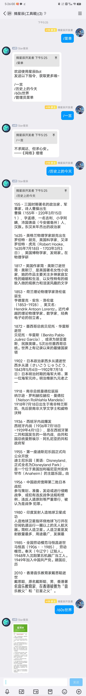

# 简介

## 欢迎来到 `星辰Bot` 项目！这是一款基于 Nonebot2 打造的智能 QQ 机器人，旨在为用户提供丰富的功能体验。无论是获取一言的灵感，探索历史上的今天，还是穿梭60s世界，`星辰Bot` 为您打开了全新的交流之门。快来尝试吧！

# 文档

### [Nonebot Docs](https://nonebot.dev/)
### [怎么配置(必看)](Config.md)

# 如何开始

1. 使用以下命令克隆本项目

```
git clone https://github.com/StarXinXin/StarsBot.git  
```
2. 安装依赖
```
pip install -r requirements.txt
```

# 创建插件

1. 使用 'nb plugin create' 创建您的插件。
2. 在“src/plugins”文件夹下编写插件。
3. 使用“nb run --reload”运行您的机器人。


# 主要功能

## 菜单功能

* [X]  一言
* [X]  历史上的今天
* [X]  60s世界
* [X]  笑话
* [X]  点歌
* [X]  热搜榜
* [X]  天气

## 特殊功能

```
AI聊天
```

## 管理员菜单

* [X]  添加群白名单
* [X]  移除群白名单
* [X]  添加管理员
* [X]  移除管理员

### AI聊天

请@机器人账号 + 聊天内容

### 天气

这里不提供免费的APIKey哦

打开[心知天气](https://www.seniverse.com/)注册账号

在心知天气控制台创建你的产品，获得APIKey

# 预览


